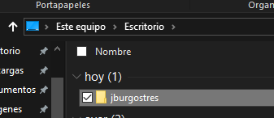
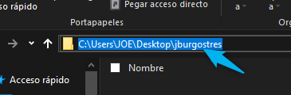
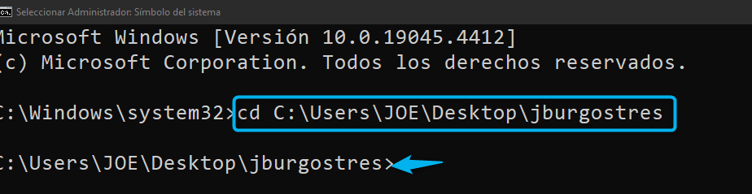
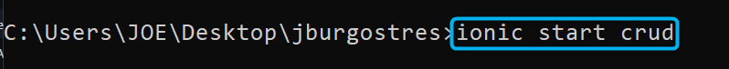
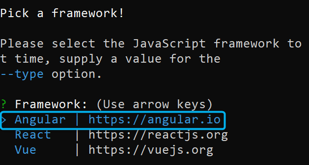
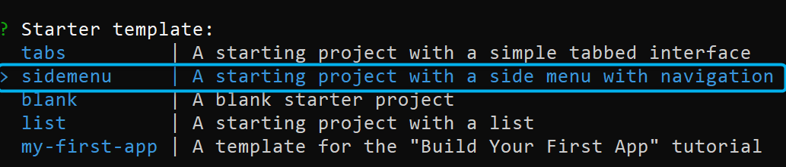
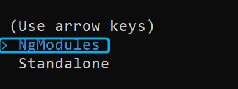
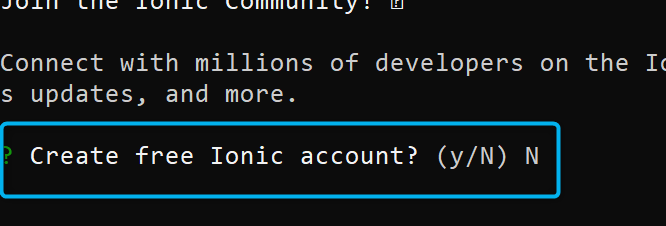
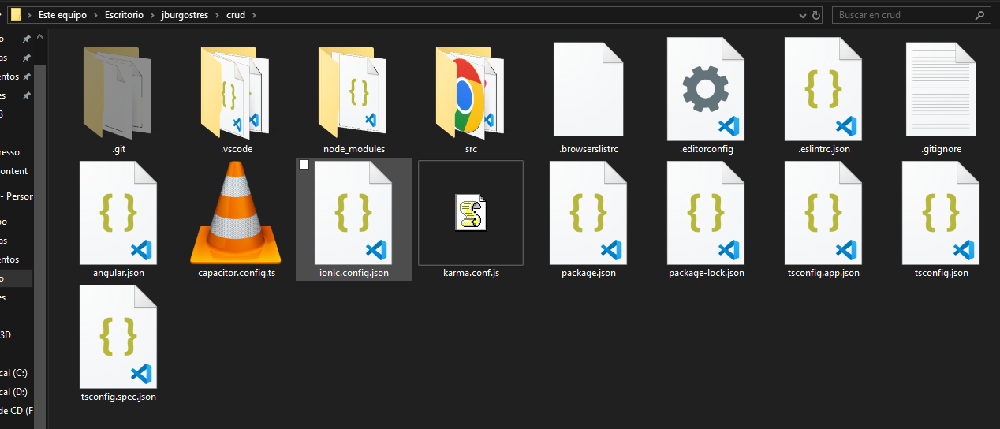

PROCEDIMIENTOS:
==============================================

- Instalar Node js ( https://nodejs.org/dist/v22.1.0/node-v22.1.0-x64.msi )
- Abrir el CMD como administrador y escribir el siguiente comando:

INSTALAR ANGULAR
=============================================

Escribir el comando: 

 **npm install -g @angular/cli** (Esperar la instalación)

INSTALAR IONIC
=============================================

Escribir el siguiente comando:

 **npm install -g @ionic/cli**

CREAR PROYECTO
=============================================

- **1. Crear una carpeta en el Escritorio con el nombre que ud desee "jburgostres"**

- **2. Copiar la ruta del proyecto "jburgostres" creado**

- **3. Ejecutar el CMD como administrador**

.. image:: img/cmd_administrador.png

- **4. agregar la siguiente linea**

 **cd larutadelproyecto**

- 3.Luego de haber ingresado a la carpeta desde el CMD escribir el siguiente comando:

 **ionic start elnombredelproyecto** (Esperar que abra la web y crear al app)

4. Aparecerá un apartado dónde deberemos seleccionar el **framework Javascript** con las teclas direccionales del teclado la linea de **"Angular"**

5. Seleccionamos el **template(plantilla)** de **slidemenu** con las teclas direccionales.

6. Seleccionamos el **Llaves permitidas (Arrow Key) NgModules** con las teclas direccionales.

**ESPERAMOS QUE SE DESCARGUE TODO EL PAQUETE DE IONIC , HASTA QUE OTRA VEZ TENGAMOS EN LA CMD LIBRE PARA ESCRIBIR OTRA LINEA**

(En el caso les muestre la opción de **create account** poner la letra N y seguido presionar Enter.

**NOS ASEGURAMOS CON ESTO QUE SE HA CREADO TODO OK**

7. En la ruta del proyecto creado de ionic , ingresar a el por medio del CMD para posteriormente digitar el siguiente comando:

 **ionic serve**

Listo!, debería mostrar la interfaz gráfica del aplicativo y sus complementos agregados en la carpeta del proyecto creado.

