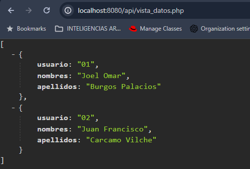

PROCEDIMIENTOS:
==============================================

- **Descargar la base de datos e importarla a su SGBD ( https://drive.google.com/file/d/1T39IFfaz8qBK-6PVIjBjrwxW5pKqGPWL/view?usp=sharing )**

CREAR PROYECTO PHP
=============================================

En la ruta **"C:/Xampp/htdocs/":**

Crear una carpeta de nombre **api**

dentro de la carpeta creada **api**, crear los siguientes scripts:

**1. conexion.php**

.. image:: img/conexion.png

**2. eliminar.php**

**3. vista_datos.php**

.. image:: img/vista_datos.png

EJECUTAR EN EL NAVEGADOR:
==============================================

1.Abrir el navegador y copiar la siguiente ruta URL **localhost/api/vista_datos.php** y si está usando el puerto 8080 sería **localhost:8080/api/vista_datos.php** 

luego verá en el navegador los datos, los cuáles son:

COMANDOS A UTILIZAR:
==============================================
1. ionic g page [elnombredelapaginanueva] (para crear página nueva)

COMANDOS PARA PODER ESTABLECER CONEXIÓN ENTRE EL APLICATIVO CON EL API PHP

1. ionic g service api
2. npm install ionic-native
3. npm install @ionic-native/network

SOLUCIONAR ERRORES DE NPM TEMPORALES:
==============================================
1. npm install --save --legacy-peer-deps
2. npm config set legacy-peer-deps true
3. npm cache clean --force

