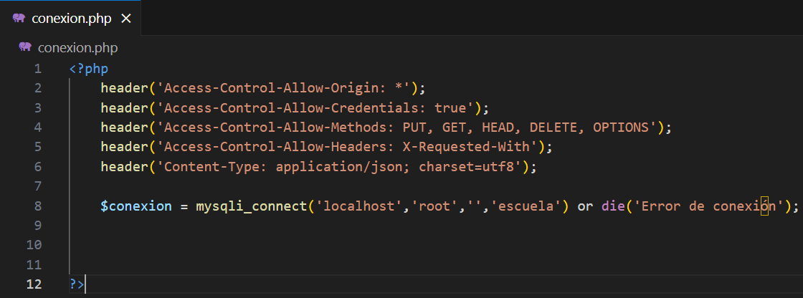
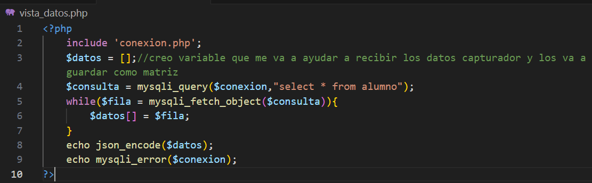

PROCEDIMIENTOS:
==============================================

- **Descargar la base de datos e importarla a su SGBD ( https://drive.google.com/file/d/10CCp2E5Fz0SBKAUFEjWQOdgx0ZcN3RZj/view?usp=sharing)**

CREAR PROYECTO PHP
=============================================

En la ruta **"C:/Xampp/htdocs/":**

Crear una carpeta de nombre **api**

dentro de la carpeta creada **api**, crear los siguientes scripts:

**1. conexion.php**

**2. eliminar.php**

**3. vista_datos.php**

EJECUTAR EN EL NAVEGADOR:
==============================================

1.Abrir el navegador y copiar la siguiente ruta **localhost/api/vista_datos.php** y si está usando el puerto 8080 sería **http://localhost:8080/api/vista_datos.php** 

luego verá en el navegador los datos, los cuáles 
