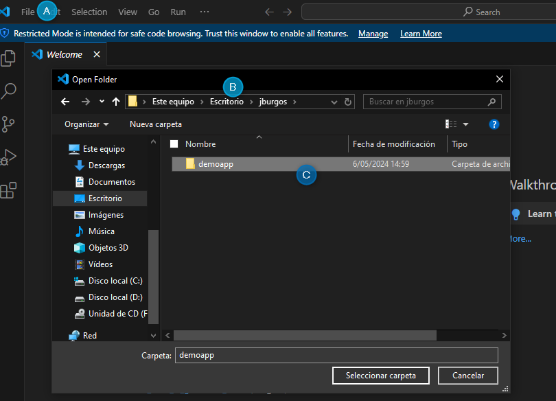
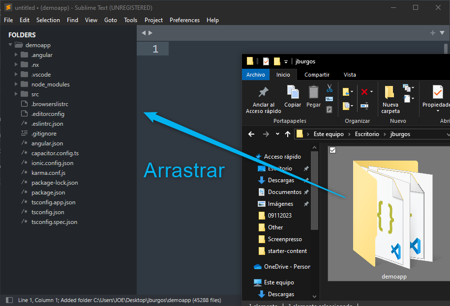
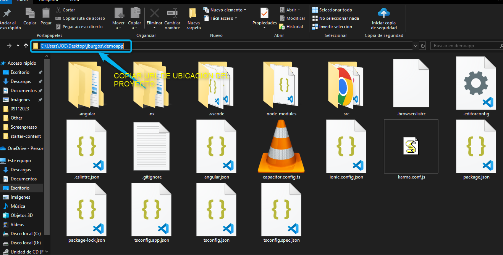
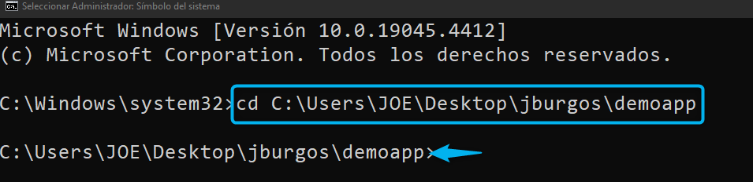
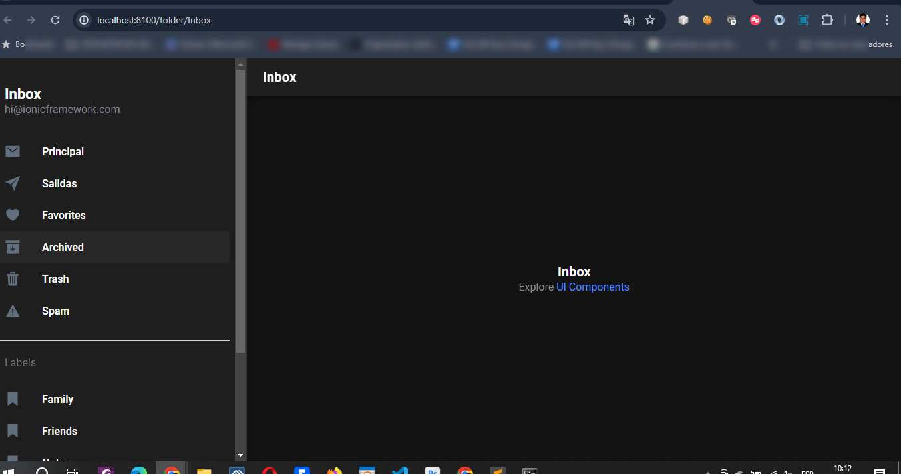

PARA EJECUTAR PROYECTO PREVIAMENTE CREADO
=============================================

**En este case se estará explicando con otro proyecto de nombre "demoapp"... UD LO HARÁN CON SU PROYECTO CREADO**

1. Abrir la carpeta del proyecto con su editor de texto preferido:

PARA VISUAL STUDIO CODE(Pasos a seguir):

a. Abrir el VS Code

b. Clic en "File > Open Folder"

c. Buscamos y seleccionados la carpeta de proyecto

PARA SUBLIME TEXT 3

a. Abrir el Sublime Text

b. Arrastrar y soltar la carpeta del proyecto hacia el Sublime Text

2. Abrir el CMD como administrador

3. Ingresamos a la carpeta del proyecto creado y copiar la ruta del proyecto

4. En el CMD , agregar la lina de comando **cd** seguido del la ruta del proyecto (Enter), asegurandonos de estar en la carpeta del proyecto.

5. Ejecutar el comando:

 **ionic serve**

.. image:: img/correr_servidor_ionic.png

6. Esperar que abra el navegador con la interface del aplicativo , **plantilla slidemenu**

