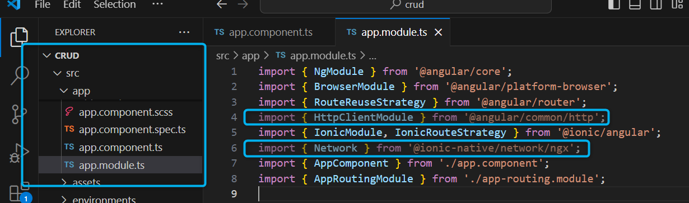
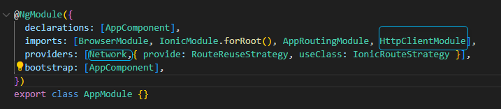
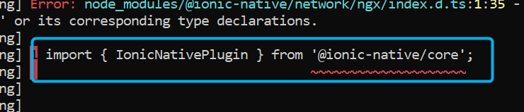
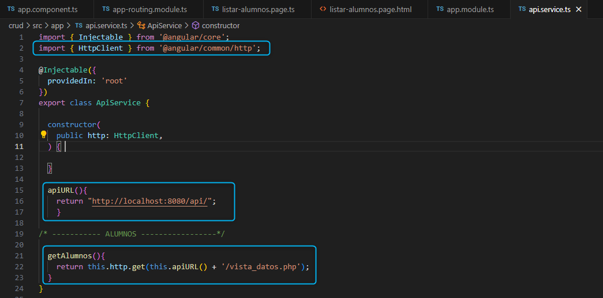

✔️​ CREAR PÁGINAS EN IONIC Y ACTIVAR SERVICIOS API PARA CONSUMIR:
===================================================================

**PREVIO DE ELLO DEBEMOS ESTAR DENTRO DE LA CARPETA DEL PROYECTO EN OTRO CMD**

- **1. Copiar la ruta del proyecto "crud" creado**

.. image:: img/ruta_crud_proyecto.png

- **2. Ejecutar el CMD como administrador**

.. image:: img/cmd_administrador.png

- **3. Ingresamos a la carpeta del proyecto desde el comando cd **
  cd crud

.. image:: img/ingresamos_cd_crud.png

- **4. En la ruta del proyecto creado de ionic , ingresar a el por medio del CMD para posteriormente digitar el siguiente comando:**

 **ionic serve**

AHORA: **Vamos a crear nuestra primera página que me permitirá AGREGAR ALUMNOS:**

1. SIN CERRAR LA VENTANA DEL CMD en dónde tiene ejecutado su servidor de IONIC, deberá **abrir otra ventana CMD** como administrador y ejecutar la siguiente línea:

  ionic g page agreg-alumno (ud podría asignar el nombre que desee)

.. image:: img/ingresamos_crud_page.png

**SI nos aparece un mensaje indicanos acaeptar algo, ponemos la letra N** (seguido de Enter)

Deberá generar el un mensaje CREATE o **"[OK] Generated page!"** para asegurarnos que se ha creado la página

.. image:: img/pag_creada.png

además verificamos si en nuestro proyecto se creó la página

.. image:: img/pag_creada_verfi_proyecto.png

COMANDOS PARA PODER ESTABLECER CONEXIÓN ENTRE EL APLICATIVO CON EL API PHP POR MEDIOS DE PETICIONES
====================================================================================================

1. comando

  **ionic g service api**

.. image:: img/ionic-server.png

2. comando

  **npm install ionic-native**

.. image:: img/ionic_native.png

3. comando

  **npm install @ionic-native/network**

.. image:: img/native_network.png

SECUENCIAS DE PROGRAMACIONES EN DIVERSOS ARCHIVOS DEL PROYECTO
=================================================================

1. En el script app.module.ts , agregamos la siguientes líneas que están señaladas

En el caso les genere el siguiente error:

lo podrá solucionar con la siguiente línea

 npm install @ionic-native/core

.. image:: img/sol_error_ionicnative.png

Cerrar y volver a ejecutar el servidor del proyecto ionic.

2. LISTAR ALUMNOS (luego se ordenerá):
==============================================
1. Crear una página nueva de nombre **listar-alumno**, para ello deberá agregar el siguiente comando:

  ionic g page listar-alumno

Posteriormente agregar una lineas que están señaladas

2. Ir al archivo **api.service.ts**

Ruta: Src > app > **api.service.ts**

3. En el CMD (ejecutado como administrador e ingresado a su proyecto), agregar el siguiente comando

 npm install @ionic-native/core

.. image:: img/sol_error_ionicnative.png

4. Ir al archivo **listar-alumnos.page.ts**

Ruta: Src > app > listar-alumnos > **listar-alumnos.page.ts**

.. image:: img/listar-alumnos1.png

.. image:: img/listar-alumnos2.png

5. Ir al archivo **app-routing.module.ts**

Ruta: Src > app > **app-routing.module.ts**

.. image:: img/approutingmodule.png

6. Ir al archivo **app.component.ts**

Ruta: Src > app > **app.component.ts**

.. image:: img/appcomponentes.png

SOLUCIONAR ERRORES DE NPM TEMPORALES:
==============================================
1. npm install --save --legacy-peer-deps
2. npm config set legacy-peer-deps true
3. npm cache clean --force

