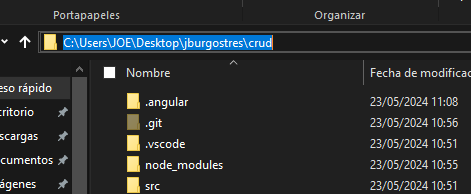
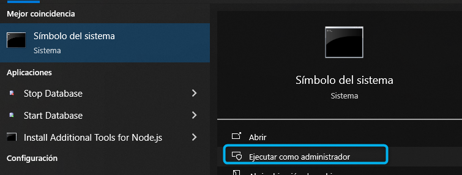
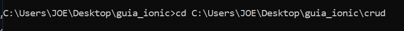
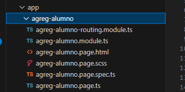
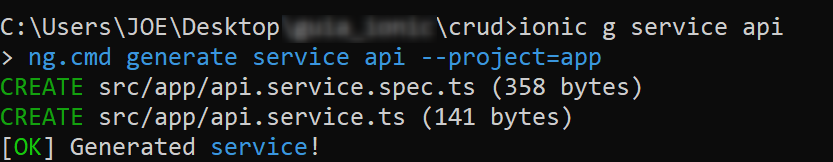
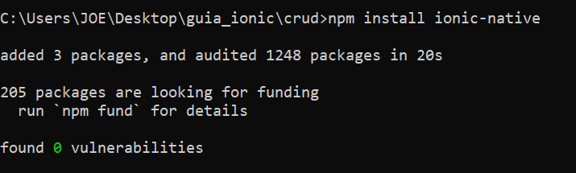

✔️​ CREAR PÁGINAS EN IONIC Y ACTIVAR SERVICIOS API PARA CONSUMIR:
===================================================================

**PREVIO DE ELLO DEBEMOS ESTAR DENTRO DE LA CARPETA DEL PROYECTO EN OTRO CMD**

- **1. Copiar la ruta del proyecto "crud" creado**

- **2. Ejecutar el CMD como administrador**

- **3. Ingresamos a la carpeta del proyecto desde el comando cd **
  cd crud

- **4. En la ruta del proyecto creado de ionic , ingresar a el por medio del CMD para posteriormente digitar el siguiente comando:**

 **ionic serve**

AHORA: **Vamos a crear nuestra primera página que me permitirá AGREGAR ALUMNOS:**

1. SIN CERRAR LA VENTANA DEL CMD en dónde tiene ejecutado su servidor de IONIC, deberá **abrir otra ventana CMD** como administrador y ejecutar la siguiente línea:

  ionic g page agreg-alumno (ud podría asignar el nombre que desee)

.. image:: img/ingresamos_crud_page.png

**SI nos aparece un mensaje indicanos acaeptar algo, ponemos la letra N** (seguido de Enter)

Deberá generar el un mensaje CREATE o **"[OK] Generated page!"** para asegurarnos que se ha creado la página

.. image:: img/pag_creada.png

además verificamos si en nuestro proyecto se creó la página

COMANDOS PARA PODER ESTABLECER CONEXIÓN ENTRE EL APLICATIVO CON EL API PHP POR MEDIOS DE PETICIONES
====================================================================================================

1. comando

  **ionic g service api**

2. comando

  **npm install ionic-native**

3. comando

  **npm install @ionic-native/network**

.. image:: img/native_network.png

SOLUCIONAR ERRORES DE NPM TEMPORALES:
==============================================
1. npm install --save --legacy-peer-deps
2. npm config set legacy-peer-deps true
3. npm cache clean --force

