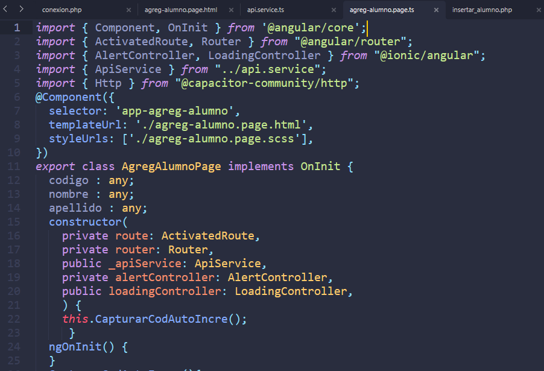
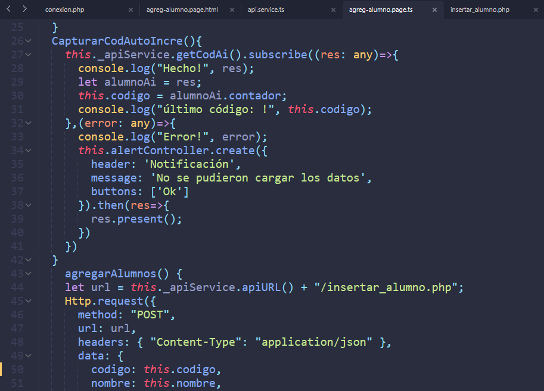
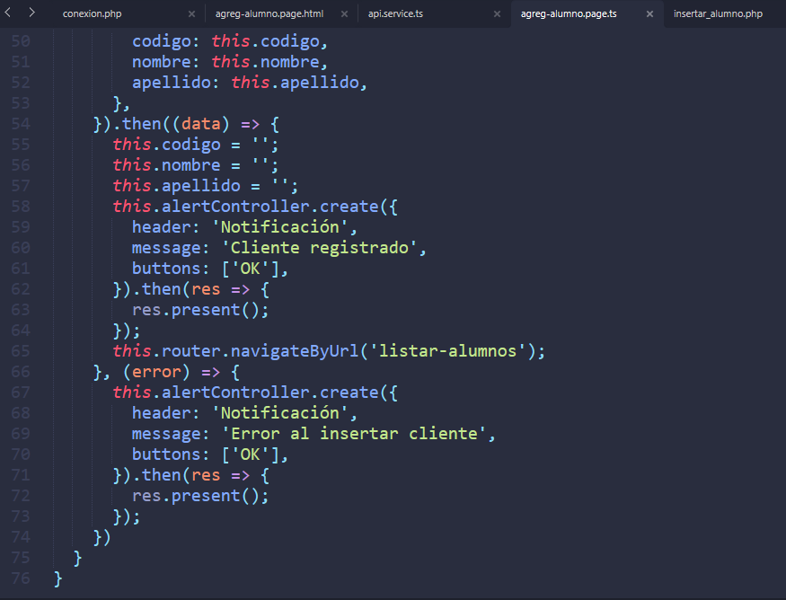
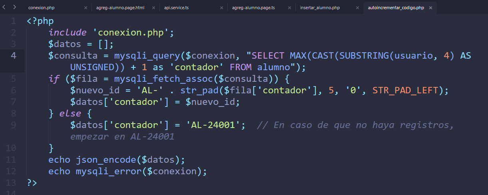
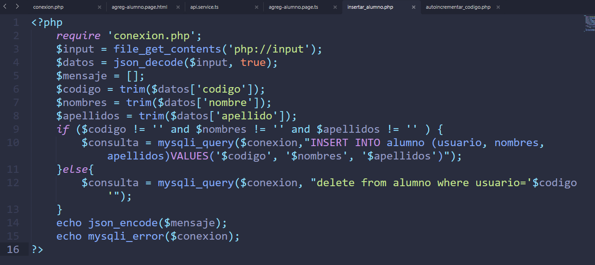
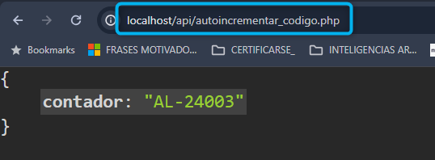
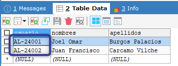

⌚​🤖​✔️​INSERTAR ALUMNOS ⌚​🤖​✔️​:
==============================================
**Nota: si desea agregar emojis a su app, puede visitar la siguiente web.**

https://emojikeyboard.top/es/

1. Ingresar a la carpeta del proyecto IONIC y correr el servidor con el comando

Linea::

  ionic serve

Posteriormente agregar una lineas que están señaladas

2. Ir al archivo **agreg-alumno.page.html**

Ruta: Src > app > agreg-alumno > **agreg-alumno.page.html**

.. image:: img/agreg-alumnopage.png
   :height: 40
   :width: 90
   :scale: 10
   :alt: JoeAI

3. Ir al archivo **api.service.ts**

Ruta: Src > app > **api.service.ts**

.. image:: img/apiservicests.png
   :height: 40
   :width: 90
   :scale: 10
   :alt: JoeAI

4. Ir al archivo **agreg-alumno.page.ts**

Ruta: Src > app > agreg-alumno > **agreg-alumno.page.ts**

✔️​EN EL API: "C:/xampp/htdocs/api" ​✔️​:
==============================================

5. En el archivo **api**

Ruta: C:/xampp/htdocs/api/ **autoincrementar_codigo.php**

Ruta: C:/xampp/htdocs/api/ **insertar_alumno.php**

VERIFICAR SI autoincrementar_codigo.php CONSUME DATOS:
==============================================

6. En el navegador ir a la ruta **http://localhost/api/autoincrementar_codigo.php**

MODIFICACIÓN DE ESTRUCTURA DE CÓDIGO SEGUN EL FORMATO:
=======================================================

7. deberá actualizar los códigos respetando la estructura que se autoincrementará

SOLUCIONAR ERRORES DE NPM TEMPORALES:
==============================================
1. 
Linea::

  npm install --save --legacy-peer-deps

2. 
Linea::

  npm config set legacy-peer-deps true

3. 
Linea::

  npm cache clean --force

