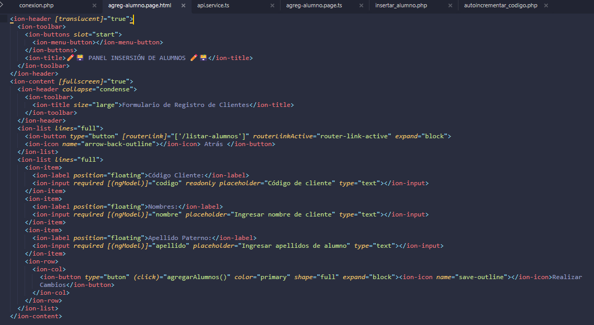
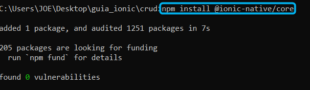
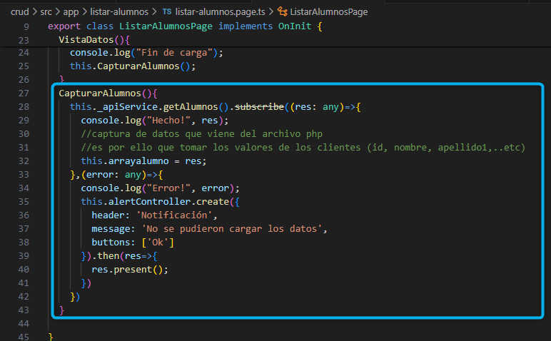
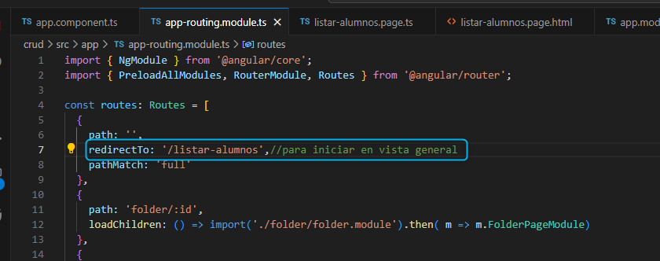
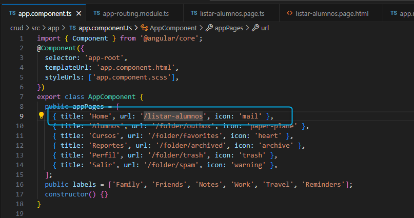
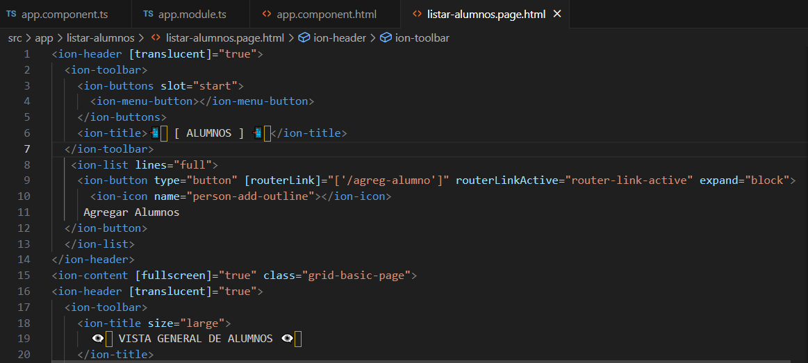
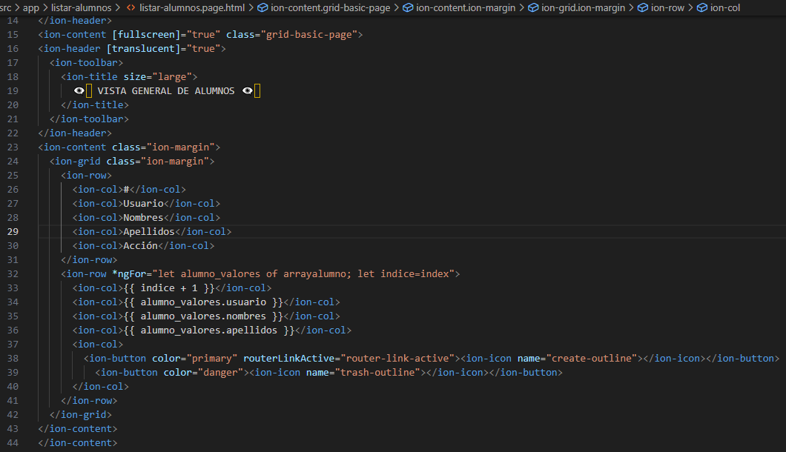
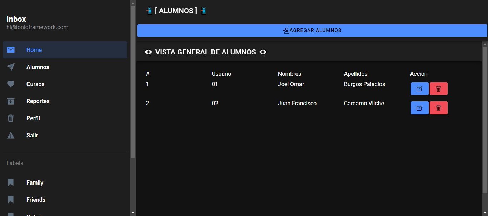

⌚​🤖​✔️​INSERTAR ALUMNOS ⌚​🤖​✔️​:
==============================================
1. Ingresar a la carpeta del proyecto IONIC y correr el servidor con el comando

Linea::

  ionic serve

Posteriormente agregar una lineas que están señaladas

2. Ir al archivo **agreg-alumno.page.html**

Ruta: Src > app > agreg-alumno > **agreg-alumno.page.html**

3. En el CMD (ejecutado como administrador e ingresado a su proyecto), agregar el siguiente comando

Linea::

  npm install @ionic-native/core

4. Ir al archivo **listar-alumnos.page.ts**

Ruta: Src > app > listar-alumnos > **listar-alumnos.page.ts**

.. image:: img/listar-alumnos1.png
   :height: 45
   :width: 90
   :scale: 10
   :alt: JoeAI

5. Ir al archivo **app-routing.module.ts**

Ruta: Src > app > **app-routing.module.ts**

6. Ir al archivo **app.component.ts**

Ruta: Src > app > **app.component.ts**

VISUALIZAR LISTA DE ALUMNOS:
==============================================

SOLUCIONAR ERRORES DE NPM TEMPORALES:
==============================================
1. 
Linea::

  npm install --save --legacy-peer-deps

2. 
Linea::

  npm config set legacy-peer-deps true

3. 
Linea::

  npm cache clean --force

