⌚​🤖​✔️​INSERTAR ALUMNOS ⌚​🤖​✔️​:
==============================================
**Nota:** si desea agregar emojis a su app, puede visitar la siguiente web.

https://emojikeyboard.top/es/

1. **Ingresar a la carpeta del proyecto IONIC y correr el servidor con el comando**

Linea::

  ionic serve

2. Crear una página nueva **mod-alumno**

Linea::

  ionic g page mod-alumno

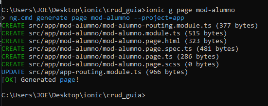

3. En el archivo **listar-alumnos.page.html**

Ruta: Src > app > listar-alumnos > **listar-alumnos.page.html**

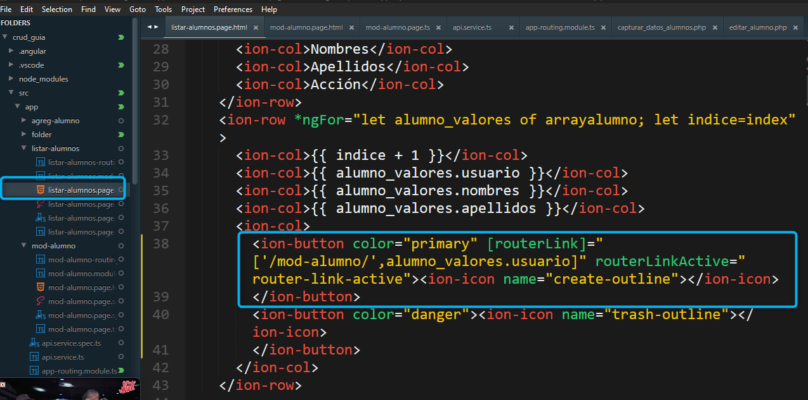

4. Ir al archivo **mod-alumno.page.html**

Ruta: Src > app > mod-alumno > **mod-alumno.page.html**

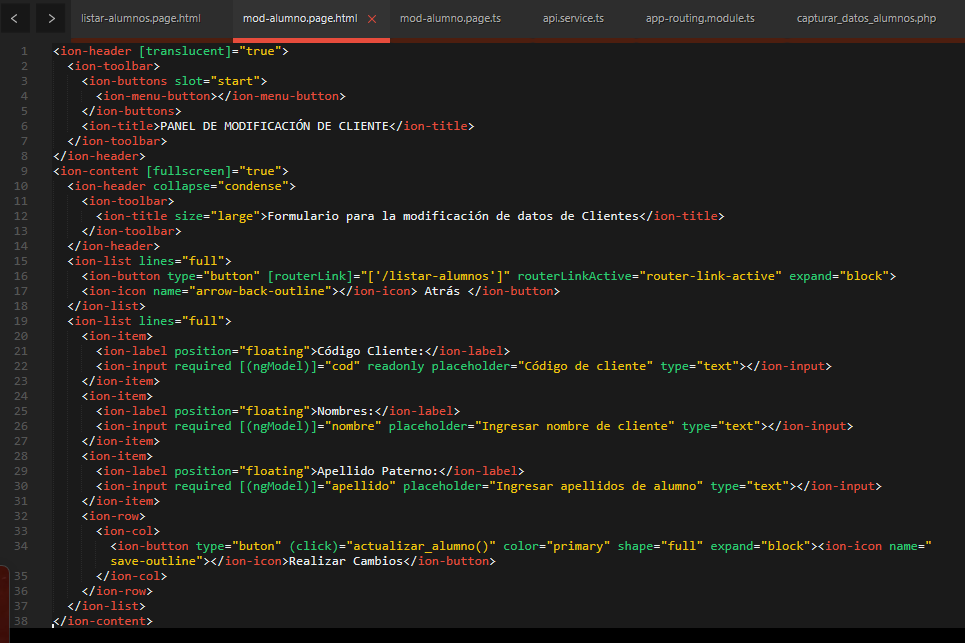

5. Ir al archivo **mod-alumno.page.ts**

Ruta: Src > app > mod-alumno > **mod-alumno.page.ts**

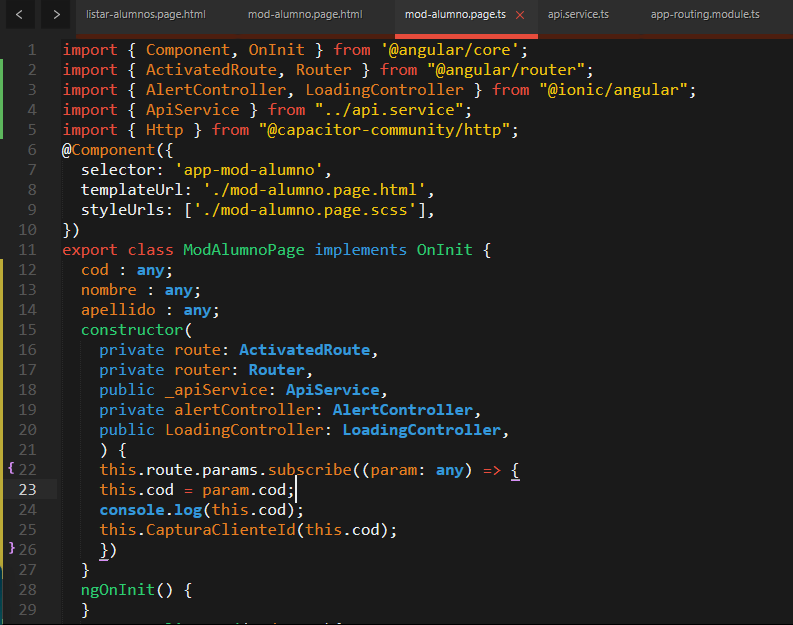

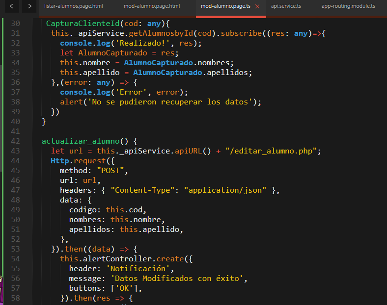

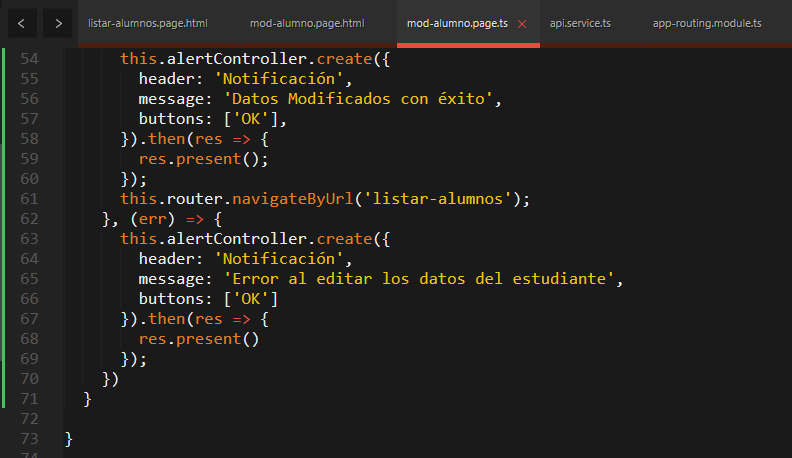

6. Ir al archivo **api.service.ts**

Ruta: Src > app > **api.service.ts**

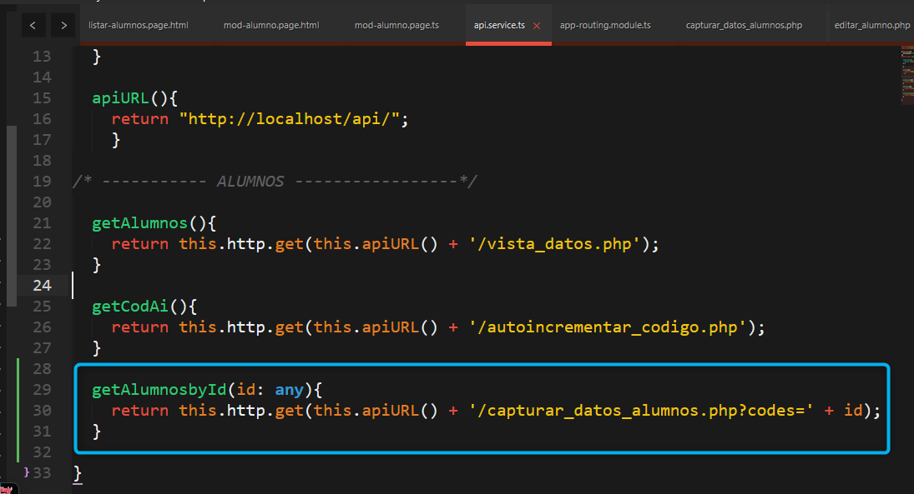

7. Ir al archivo **app-routing.module.ts**

Ruta: Src > app > **app-routing.module.ts**

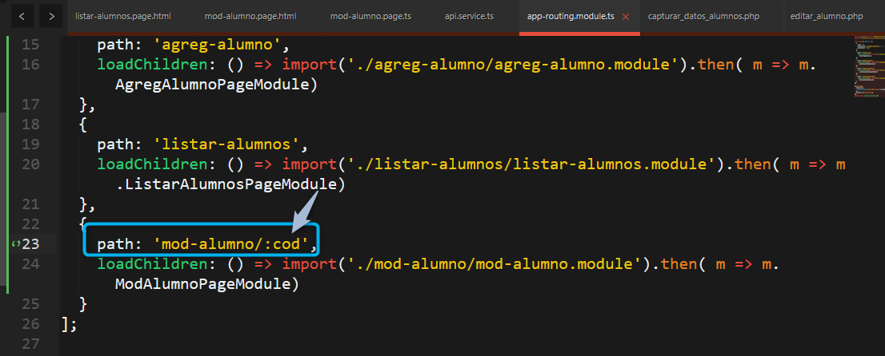

✔️​EN EL API: "C:/xampp/htdocs/api" ​✔️​:
==============================================

8. En el archivo **api**

Ruta: C:/xampp/htdocs/api/ **capturar_datos_alumnos.php**

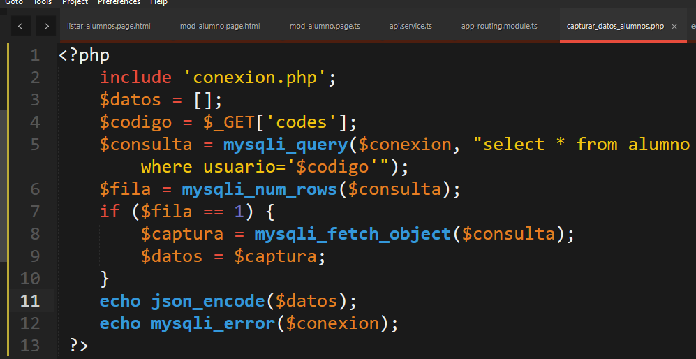

Ruta: C:/xampp/htdocs/api/ **editar_alumno.php**

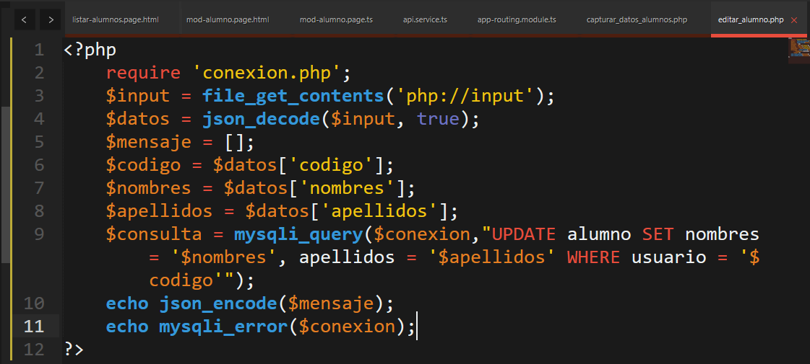

VERIFICAR SI capturar_datos_alumnos.php CONSUME DATOS:
==============================================

9. En el navegador ir a la ruta **http://localhost/api/capturar_datos_alumnos.php?codes=AL-24001**

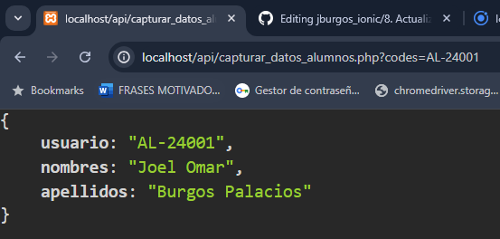

MENAJE ACTUALIZACIÓN OK:
==============================================================

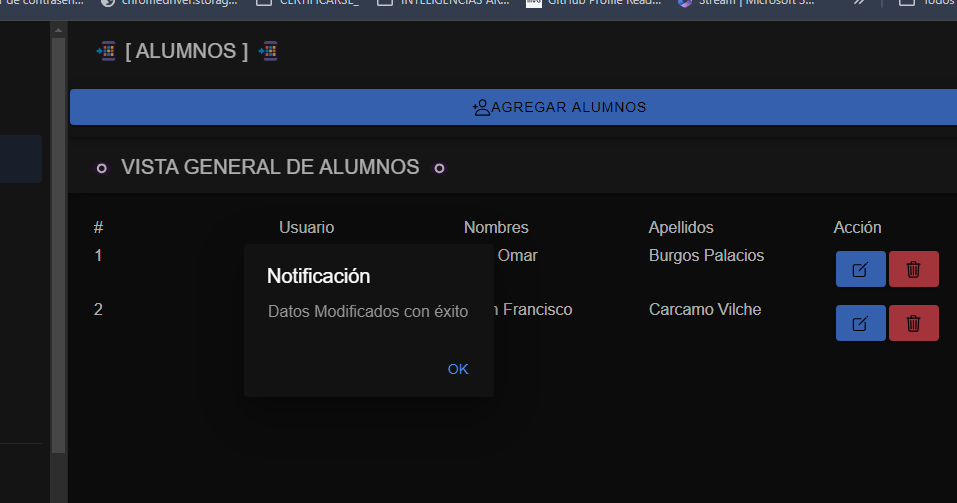

SOLUCIONAR ERRORES DE NPM TEMPORALES:
==============================================
1. 
Linea::

  npm install --save --legacy-peer-deps

2. 
Linea::

  npm config set legacy-peer-deps true

3. 
Linea::

  npm cache clean --force

