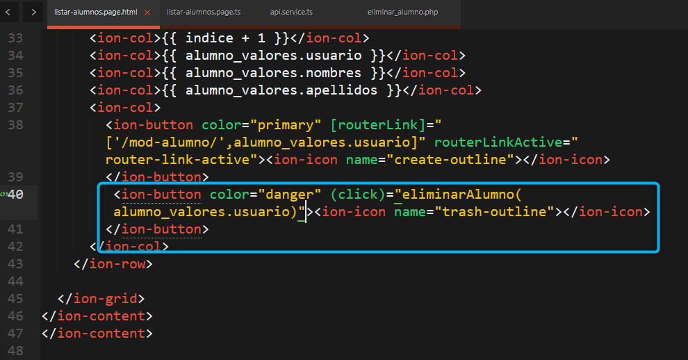
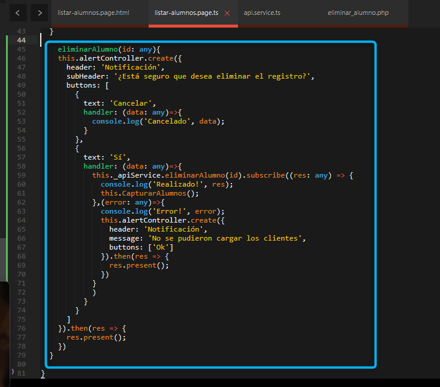
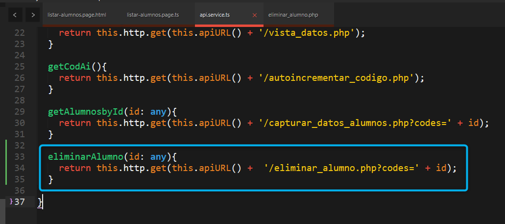
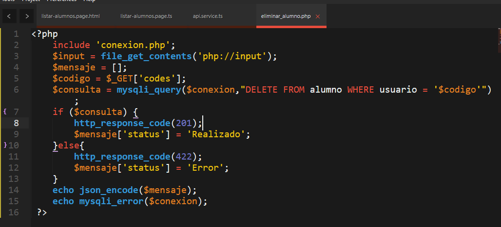
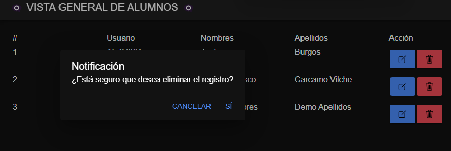

⌚​🤖​✔️​Eliminar Alumnos ⌚​🤖​✔️​:
==============================================
**Nota:** si desea agregar emojis a su app, puede visitar la siguiente web.

https://emojikeyboard.top/es/

1. **Ingresar a la carpeta del proyecto IONIC y correr el servidor con el comando**

Linea::

  ionic serve

2. En el archivo **listar-alumnos.page.html**

Ruta: Src > app > listar-alumnos > **listar-alumnos.page.html**

3. Ir al archivo **listar-alumnos.page.ts**

Ruta: Src > app > listar-alumnos > **listar-alumnos.page.ts**

4. Ir al archivo **api.service.ts**

Ruta: Src > app > **api.service.ts**

✔️​EN EL API: "C:/xampp/htdocs/api" ​✔️​:
==============================================

8. En el archivo **api**

Ruta: C:/xampp/htdocs/api/ **eliminar_alumno.php**

ELIMINACIÓN OK:
==============================================================

SOLUCIONAR ERRORES DE NPM TEMPORALES:
==============================================
1. 
Linea::

  npm install --save --legacy-peer-deps

2. 
Linea::

  npm config set legacy-peer-deps true

3. 
Linea::

  npm cache clean --force

